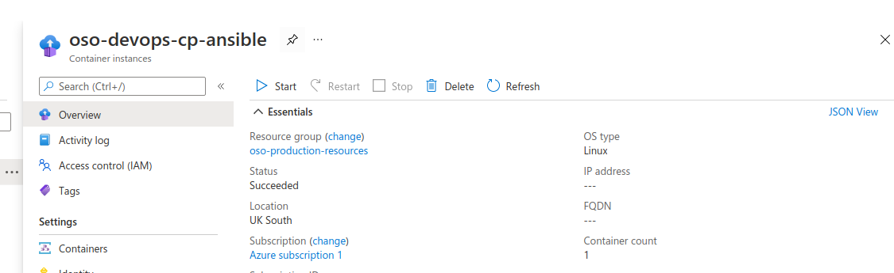
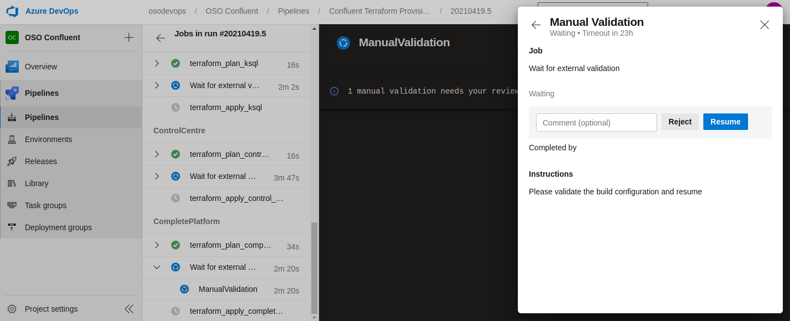

[](https://osodevops.io)

#Overview
This module provides the ability to deploy the entire confluent suite on Azure with a single command.  It achieves this by leveraging Terraform to build out the Azure infrastructure.  Within this infrastructure exists a container group which runs the docker image [osodevops/cp-ansible](https://github.com/osodevops/docker-cp-ansible) which is used to provision the confluent virtual machines.  This solution is not intended as a hardened production environment but rather provides a way to get running with Confluent on Azure *QUICKLY*.

### Getting Started
#### Requirements
* Terragrunt, please see [here](https://terragrunt.gruntwork.io/)
* Terraform, please see [here](https://www.terraform.io/)
* Azure-cli, please see [here](https://docs.microsoft.com/en-us/cli/azure/install-azure-cli)

#### Quick Start
So long as the above requirements are met (and you have successfully authorised with Azure CLI), you can get started deploying to Azure right away by running `./tldr.sh`.  You can expect this process to take approximately 35 minutes; 10 min for the Terraform, and 25 min for the ansible provisioning.  At the end of the script, you will find a URL that will enable you to access control centre to see your working cluster where you will be able to start creating topics right away!  

### Pre-Deployment Tasks
##### Generate SSH keys for virtual machines
* From the root of the project, run `./ssh-generation.sh` this will populate keys through the code base which will be used for remote access onto the Confluent servers
* Keep hold of the newly created ./modules/resource-group/oso-confluent.ssh key, this is the key you will use to SSH onto the VMs.

##### Create storage account for Terraform state
* Sign in with [Azure CLI](https://docs.microsoft.com/en-us/cli/azure/authenticate-azure-cli) (`az login`) 
* Execute `./generate_state.sh` to create a standalone resource group and storage account to be used for terraform state

### Terraform Deployment
#### Local Deployment
With the terragrunt framework, we have the ability to deploy a single module (for example, navigating into ./production/zookeerp), and running `terragrunt plan`.
Alternatively, we could navigate to the root of the environment (i.e. /production), and run `terragrunt run-all plan` to have a plan run against each module.  

**You can expect a full deployment off all components to take approximately 12 minutes**

To deploy everything at once, navigate to `./production` and run `terragrunt run-all apply`

** note: pay attention to the output variable `public_ip_address`; this is the IP you will use to connect to Control Centre (port 9021), and RestProxy (port 8082)

```
➜  production git:(develop) ✗ terragrunt run-all apply
INFO[0000] Stack at /home/azure-terraform-module-confluent/production:
=> Module /home/azure-terraform-module-confluent/production/broker (excluded: false, dependencies: [/home/azure-terraform-module-confluent/production/resource_group])
...
Are you sure you want to run 'terragrunt apply' in each folder of the stack described above? (y/n)
```

### Ansible Deployment
#### Command Line
The terraform deployment deploys a Azure container group into a private subnet which has the ability to provision the newly created VMs with [cp-ansible](https://github.com/confluentinc/cp-ansible).  

To run this container:
```
$ ./run-ansible.sh
```

This process should take approximately 25 mins to complete.

#### Azure Console (alternative deployment method)
Via the Azure Console, simply find the container group named **oso-devops-cp-ansible** in the click the 'Start' button:



#### Deploying Azure DevOps (pipelines)
##### Azure DevOps Predeployment Tasks
* [Generate an Azure Devops PAT](https://docs.microsoft.com/en-us/azure/devops/organizations/accounts/use-personal-access-tokens-to-authenticate?view=azure-devops&tabs=preview-page); set an Environment variable named `AZDO_PERSONAL_ACCESS_TOKEN ` to this value.
* For GitHub projects, you will need to [generate a PAT](https://docs.github.com/en/github/authenticating-to-github/creating-a-personal-access-token); this will be used during the 'AzureDevOps' deployment.  Set this value to `AZDO_GITHUB_SERVICE_CONNECTION_PAT`
* Set an environment varialble `AZDO_ORG_SERVICE_URL` to the value of your Azure DevOps organisation URL (i.e. https://dev.azure.com/osodevops)

##### Deploying from pipeline
* From within Azure DevOps, navigate to the 'Confluent Terraform Provisioning' pipeline job, and run the pipeline.
The Confluent platform infrastructure is made up of the following resources

```
<environment>
├── broker
│   └── terragrunt.hcl
├── control_centre
│   └── terragrunt.hcl
├── kafka_connect
│   └── terragrunt.hcl
├── ksql
│   └── terragrunt.hcl
└── resource_group
│   └── terragrunt.hcl
├── rest_proxy
│   └── terragrunt.hcl
├── schema_registry
│   └── terragrunt.hcl
├── zookeeper
│   └── terragrunt.hcl
└── env.hcl
```

To deploy the entire platform, review the automated 'terragrunt plan' stage of the 'CompletePlatform' job.  Review and approve the 'wait for external validation' stage if OK.  This will deploy all components of the Confluent Platform.  Alternatively, the service can be reviewed and deployed individually (note: the 'resource group' module must be deployed first as there is dependency of the service on this; this process is automated if deploying the 'CompletePlatform' job) 



##### Configuring a build agent
* In order to run the pipelines, a build agent is required.  Presently this is out of scope for this project, but either a properly configured self-hosted or microsoft hosted agent will work (see [here](https://docs.microsoft.com/en-us/azure/devops/pipelines/agents/agents?view=azure-devops&tabs=browser)).

### Considerations
##### Cluster customisations
All properties/configurations/hostnames for the cluster are stored in the file `./modules/resource-group/ansible-inventory.yml`.  To activate changes made to that file, perform the following operations:
* Change `./modules/resource-group/ansible-inventory.yml` as desired
* Deploy inventory into the Azure storage account by navigating to `./production/resource-group`, and running `terragrunt apply`
* Run `./run-ansible.sh`

##### Debugging Ansible
As ansible is run from a container within the Azure network, we need away to debug when things aren't working as expected.  To provide this ability, we simply need to uncomment out the `commands = ["sleep", "100000"]` on `resource "azurerm_container_group" "ansible"` found at .`/modules/resource-group/ansible-container.tf` (and then deploy these changes).  Once this is done, you will be able to exec onto this container from the Azure Console, and run ansible manually, or tweak configuration/code in-place.


##### Additional Environments
By using terragrunt's DRY approach, creating additional environments is very straight forward.  Simply copy the entire `production` folder to a new folder (i.e named `staging`), and you will be able to deploy in the same manner as production (The deployments are folder name aware).

## Help

**Got a question?**

File a GitHub [issue](https://github.com/osodevops/azure-terraform-module-confluent/issues), send us an [email][email] or tweet us [twitter][twitter].

### Bug Reports & Feature Requests

Please use the [issue tracker](https://github.com/osodevops/azure-terraform-module-confluent/issues) to report any bugs or file feature requests.

## Copyrights

Copyright © 2019-2020 [OSO DevOps](https://osodevops.io)

## License

See [LICENSE](LICENSE) for full details.

## About

[](https://osodevops.io)

We are a cloud consultancy specialising in transforming technology organisations through DevOps practices.
We help organisations accelerate their capabilities for application delivery and minimize the time-to-market for software-driven innovation.

Check out [our other projects][github], [follow us on twitter][twitter], or [hire us][hire] to help with your cloud strategy and implementation.

[![README Footer][readme_footer_img]][readme_footer_link]
[![Beacon][beacon]][website]

[logo]: https://osodevops.io/assets/images/logo-purple-b3af53cc.svg
[website]: https://osodevops.io/
[github]: https://github.com/orgs/osodevops/
[hire]: https://osodevops.io/contact/
[linkedin]: https://www.linkedin.com/company/oso-devops
[twitter]: https://twitter.com/osodevops
[email]: https://www.osodevops.io/contact/
